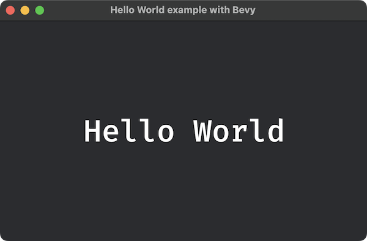

# bevy studies

My studies with [bevy engine](https://bevyengine.org/).

 

## How to run

```bash
$ cargo run --example <example_name>
# ex: cargo run --example hello_world

# Please check
# $ cargo run --example
# to list all examples
```

## License

- my code: [WTFPL](LICENSE)
- bevy engine: [MIT](https://github.com/bevyengine/bevy/blob/main/LICENSE-MIT)
